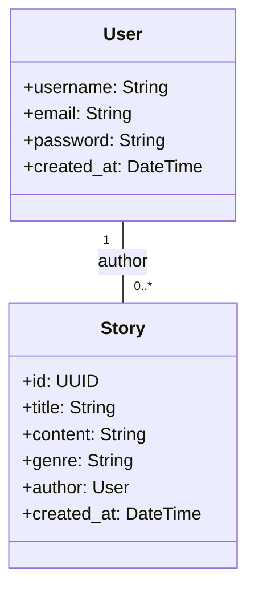
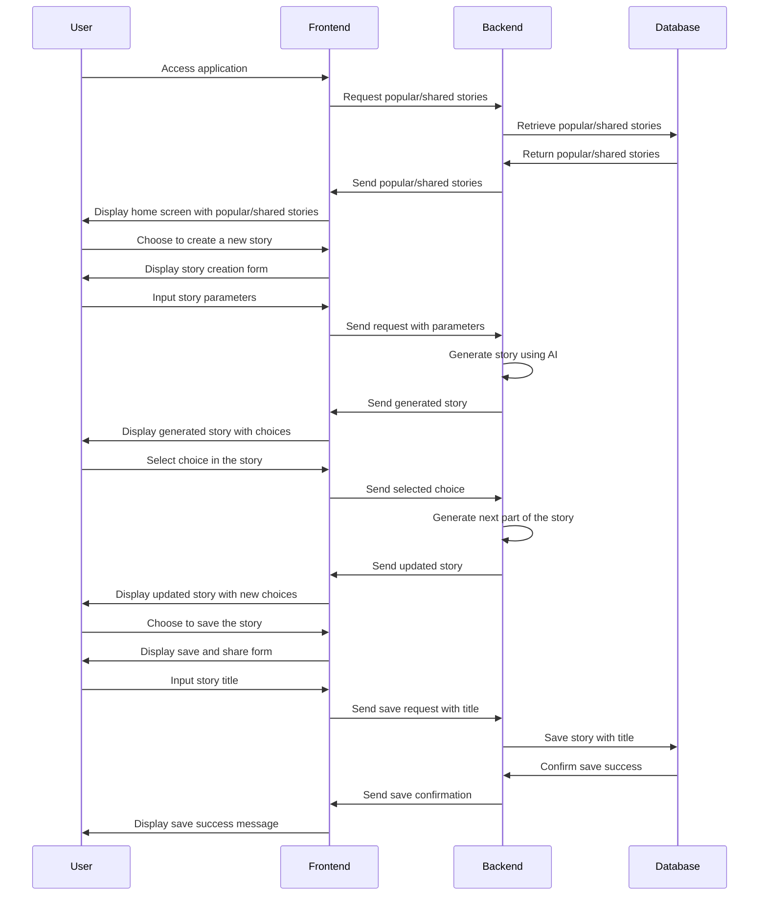

# TaleWeaver（テイルウィーバー） Design Doc

## 1. 目的
AIとユーザーが協力してインタラクティブな物語を作成するアプリケーションの開発

## 2. 主要機能
- **物語の生成**: ユーザーが指定した条件（ジャンル、キャラクター、設定など）に基づいてAIが物語を生成
- **選択肢による展開の変更**: ユーザーが物語の途中で選択肢を選ぶことで、物語の展開が変わる
- **物語の保存・共有**: 作成した物語を保存し、他のユーザーと共有できる

## 3. ユーザーインターフェース
- **ホーム画面**: 物語の生成を始めるボタン、保存済みの物語へのリンク、他のユーザーが共有した物語へのリンクがある
- **条件設定画面**: 物語の生成に必要な条件（ジャンル、キャラクター、設定など）を入力するフォームがある
- **物語表示画面**: AIが生成した物語のテキストと選択肢が表示される。選択肢を選ぶと物語の展開が変わる
- **保存・共有画面**: 物語のタイトルを入力し、保存や共有ができる

## 4. 性能要件
- **応答速度**: 物語の生成や選択肢による展開の変更にかかる時間は、ユーザーがストレスを感じない程度にする
- **同時接続数**: 多くのユーザーが同時にアプリケーションを利用できるようにする

## 5. その他の要件
- **セキュリティ**: ユーザーの個人情報や作成した物語のデータを適切に保護する
- **データ保持**: 作成した物語はデータベースに保存し、ユーザーがいつでもアクセスできるようにする
- **アクセシビリティ**: さまざまなデバイスやブラウザで利用できるようにする

## 6. システム構成要件
- **フロントエンド**: React.jsを使用してSPA (Single Page Application)を構築する。スタイリングにはTailwind CSSを利用。
- **バックエンド**: PythonのFastAPIを使用し、効率的かつ高速なAPIを提供する。また、AI部分ではOpenAI APIを利用する。
- **データベース**: PostgreSQLを利用し、物語やユーザー情報などのデータを格納する。
- **インフラストラクチャ**: AWSを利用し、ECSやECR、RDS、S3などのサービスを活用してスケーラブルなシステムを構築する。


## クラスダイアグラム


## シーケンスダイアグラム



# TaleWeaver 開発環境セットアップガイド

## Dockerの初期立ち上げ方法

プロジェクトディレクトリで以下のコマンドを実行して、Dockerコンテナを立ち上げます。

```
# docker-compose up -d
```


## Docker起動後にデータベースへの接続方法・サンプルクエリ

データベースへの接続は、以下のコマンドを実行してください。

```
docker-compose exec db psql -U ${POSTGRES_USER} -d taleweaver
```


サンプルクエリとして、`stories`テーブルから全てのデータを取得するクエリを実行します。

```sql
SELECT * FROM stories;
```

## 開発中にデータベースを再構築したくなった場合の手順
データベースを再構築するには、以下の手順を実行します。

1. Dockerコンテナを停止します。

```
# docker-compose down
```

2. ボリュームデータを削除します。

```
# docker volume rm taleweaver_pgdata
```

3. Dockerコンテナを再起動します。

```
# docker-compose up -d
```
これにより、データベースが初期状態に戻ります。

## Dockerをシャットダウンする方法
Dockerコンテナをシャットダウンするには、以下のコマンドを実行します。

```
# docker-compose down
```

## その他有用な情報
- アプリケーションはポート3000で実行されます。ブラウザで http://localhost:3000 にアクセスしてアプリケーションを表示できます。
- PostgreSQLデータベースはポート5432で実行されます。データベースに接続する際には、このポート番号を使用してください。

